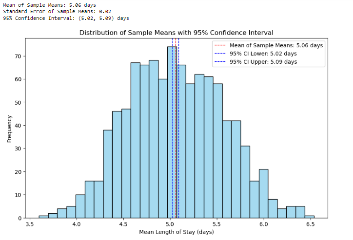

# Project7-STM-Calculating-Mean-Hospital-Stay
> **Brief Description:** Calculating the mean length of hospitals stay of patients

---

## Table of Contents

- [Description](#description)
- [Video Explanation](#video)
- [Technologies Used](#technologies-used)
- [Dataset](#dataset)
- [Program Codes ](#program-codes)
- [Screenshots](#screenshots)
- [Contribution](#contributipn)
- [Contact Details](#contact-details)

---

## Description

Finding the mean length of hospitals stay of patients

## Video
<!--
 
-->

We are working on this section. Please check at some other time. We have used Central Limit Theorem and worked witha population of 10000 and worked with 1000 samples of sample size 50.

## Technologies-used

Python programming language, pandas and matplotlib package.

## Dataset

The data set is synthetically generated and used for demonstrating the concept only. The program can be easily modified to show results with real readings taken from the patients.

## Program-codes

The programs are written on jupiter notebook, You may run the program on Google colab by clicking on the colab badge below.

## Screenshots

The program generates and plots a histogram to illustrate the distribution of sample means for lengths of hospital stays, along with a 95% confidence interval. Here's what the plot communicates in layman's terms:

### Plot Overview:
1. **Histogram**:
   - The histogram shows the frequency distribution of the mean lengths of stay for multiple samples taken from a larger population.
   - It includes lines representing the overall mean of the sample means and the bounds of the 95% confidence interval.

### Key Points:
1. **Sample Means**:
   - The program takes multiple random samples from a larger population of hospital stay lengths and calculates the mean length of stay for each sample.
   - This process is repeated many times (1,000 samples of 50 stays each) to create a distribution of sample means.

2. **Overall Mean and Standard Error**:
   - The overall mean of the sample means represents the average length of stay across all samples.
   - The standard error measures how much the sample means vary from the overall mean.

3. **95% Confidence Interval**:
   - The confidence interval provides a range within which we expect the true population mean to fall 95% of the time.
   - It is calculated using the overall mean, the standard error, and a critical value (z-value) for the desired confidence level.

### Interpretation:
- **Distribution of Sample Means**:
  - The histogram shows how the sample means are distributed around the overall mean.
  - Most sample means cluster around the overall mean, forming a bell-shaped curve.

- **Confidence Interval**:
  - The red dashed line represents the overall mean of the sample means.
  - The blue dashed lines represent the lower and upper bounds of the 95% confidence interval.
  - This interval gives a range that likely contains the true average length of stay for the entire population.

### In Layman's Terms:
The plot visually explains the concept of sampling and confidence intervals in the context of hospital stays. Each bar shows how often different average lengths of stay (from multiple samples) occur.

- **Average Length of Stay**:
  - The red dashed line shows the average length of stay calculated from all the samples.
  
- **Confidence Interval**:
  - The blue dashed lines show the range where we are 95% confident that the true average length of stay for the entire population lies.
  - This means if we repeated this sampling process many times, 95 out of 100 times, the true average length of stay would fall within this range.

This plot helps to understand how sampling works and how we can use confidence intervals to estimate population parameters with a certain level of confidence.

## Contribution

The programs are written by Santanu Karmakar

## Contact-details

If you wish to contact me, please leave a message (Preferably WhatsApp) on this number: 6291 894 897.
Please also mention why you are contacting me. Include your name and necessary details.
Thank you for taking an interest.
